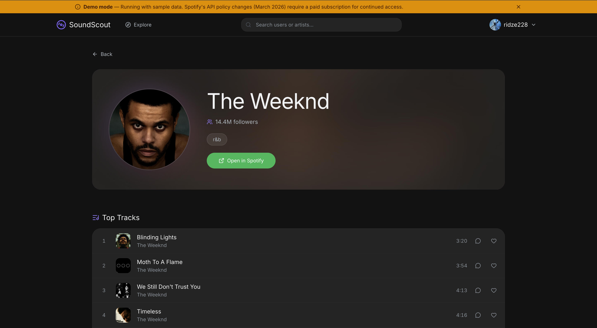

# SoundScout

A full-stack music discovery platform where users explore genres, discover artists, listen to track previews, save favorites, and interact through comments. Built as a capstone project at Odessa National Polytechnic University.

**Live demo:** _coming soon_



> **Note on demo mode:** Spotify introduced mandatory paid subscriptions for API access in March 2026, which broke the original integration. The deployed version runs in demo mode with cached data from Deezer's free API (293 real artists across 20 genres with working 30-second previews). All features — auth, profiles, favorites, comments, admin — work normally against a live database. The full Spotify-powered version runs locally with valid API credentials.

## What it does

The app follows a guided discovery flow:

```
Main Genre  →  Subgenre  →  Artists  →  Artist Detail
  (Rock)     (Indie Rock)  (Radiohead)  (Bio + Tracks + Similar)
```

Users can browse 15 main genres with 400+ subgenres, listen to 30-second previews through a persistent audio player, add tracks to favorites, leave comments on artists and tracks, customize their profile with avatars and banners, and view other users' activity. Admins get a separate panel for user management and comment moderation.

## Tech stack

| Layer | Tech |
|-------|------|
| Frontend | React 19, TypeScript, Vite 7 |
| Styling | Tailwind CSS v4 (design tokens via `@theme`) |
| State | TanStack Query (server), React Context (client) |
| Animations | Framer Motion |
| Backend | FastAPI, Python 3.9+ |
| Database | MongoDB (Motor async driver) |
| Auth | JWT (access + refresh tokens), bcrypt |
| APIs | Spotify Web API / Deezer API (demo fallback) |

## Project structure

```
backend/
  app/
    api/v1/          8 route modules (auth, genres, artists, favorites, comments, profile, search, admin)
    services/        Business logic (spotify, deezer, auth, comments, favorites, uploads, search)
    models/          Pydantic models (user, comment, track, token)
    core/            Config, security (JWT + bcrypt), custom exceptions
    data/            Genre taxonomy (genres_dict.json) + demo fixtures
  scripts/           Demo data generation script

frontend/src/
  pages/             16 pages (landing, auth, discovery flow, profile, settings, admin)
  components/        22 reusable components + 7 discovery-specific ones
  hooks/             10 hook modules exporting 30+ hooks
  services/          API layer (axios instance with auth interceptors, token refresh)
  contexts/          Auth state, audio player state
  layouts/           App shell, marketing layout, navbars, footer
  constants/         Static data (genre icons, landing content, navigation)
  utils/             Formatting, error extraction, animations, image cropping
```

## Running locally

**Prerequisites:** Node.js 18+, Python 3.9+, MongoDB 6+

```bash
# Start MongoDB
mongod --dbpath ~/data/db

# Backend
cd backend
python -m venv venv && source venv/bin/activate
pip install -r requirements.txt
cp .env.example .env  # fill in your secrets
python main.py        # runs on :8000

# Frontend
cd frontend
npm install
npm run dev           # runs on :3000, proxies /api to :8000
```

### Environment variables

**Backend** (`.env`):
```
MONGODB_URL=mongodb://localhost:27017
DATABASE_NAME=soundscout
SECRET_KEY=<32+ char secret>
SPOTIFY_CLIENT_ID=<from developer.spotify.com>
SPOTIFY_CLIENT_SECRET=<from developer.spotify.com>
DEBUG=True
```

**Frontend** (`.env`):
```
VITE_API_URL=http://localhost:8000/api/v1
```

### Demo mode

To run without Spotify credentials (uses cached artist data):

```bash
# Backend
DEMO_MODE=true python main.py

# Frontend
VITE_DEMO_MODE=true npm run dev
```

## Key implementation details

**Auth flow** — JWT access tokens (15 min) + refresh tokens (7 days). The axios interceptor queues concurrent requests during token refresh to avoid race conditions. Login clears the React Query cache to prevent cross-account data leaks.

**Audio player** — Persistent across page navigation via context provider. Plays 30-second previews sourced from Spotify (or Deezer as fallback when Spotify previews are unavailable).

**Search** — Debounced global search bar (300ms) returning users from MongoDB (regex, up to 5) and artists from Spotify/demo data (up to 3) in parallel via `asyncio.gather`.

**Image uploads** — Avatar and banner uploads with server-side validation: magic bytes check (JPEG, PNG, WebP), size limits (2MB / 5MB), and path traversal prevention. Images served as static files.

**Comments** — Stored with denormalized user data but avatars are fetched live via MongoDB `$lookup` aggregation to stay current after profile changes. Soft delete for moderation.

**Demo mode** — A `DemoService` that mirrors the `SpotifyService` interface, reading from 309 cached JSON files instead of making API calls. For uncached subgenres, it falls back to artists from the same main genre family. Data was generated from Deezer's free API using `scripts/generate_demo_data.py`.

## API overview

All routes under `/api/v1`:

- `/auth` — Register, login, refresh, logout
- `/genres` — Browse main genres, subgenres, search
- `/artists` — Artist details, top tracks, similar artists, browse by genre
- `/favorites` — Add/remove/list/batch-check favorited tracks
- `/comments` — CRUD on artist and track comments
- `/profile` — User profile, avatar/banner upload, settings, public profiles
- `/search` — Global search (users + artists)
- `/admin` — Platform stats, user management, comment moderation

## Contributing

This is a university capstone project so it's not actively seeking contributions, but if you find a bug or have a suggestion feel free to open an issue. If you want to contribute code:

1. Fork the repo
2. Create a branch (`git checkout -b fix/something`)
3. Commit your changes
4. Open a pull request

No formal code style guide — just keep it consistent with what's already there.